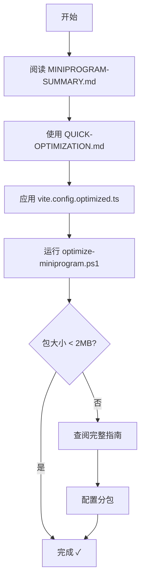

# 微信小程序优化文档使用指南

## 📚 文档清单

### 核心文档
1. **MINIPROGRAM-SUMMARY.md** ⭐ 开始这里
   - 总体概述和快速导航
   - 优化方案对比
   - 成功案例

2. **QUICK-OPTIMIZATION.md** ⚡ 5分钟快速优化
   - 最小改动方案
   - 立即可用的配置
   - 快速检查清单

3. **WECHAT-MINIPROGRAM-OPTIMIZATION.md** 📖 完整指南
   - 所有优化策略详解
   - 代码示例
   - 最佳实践

### 配置文件
4. **vite.config.optimized.ts** 🔧
   - 开箱即用的 Vite 配置
   - 代码压缩和优化
   - 直接使用或参考

### 工具脚本
5. **optimize-miniprogram.ps1** 🚀
   - 自动检查和优化
   - 包大小分析
   - 构建测试

## 🎯 使用流程

### 新手路线（推荐）



### 老手路线

```bash
# 1. 直接使用优化配置
cp vite.config.optimized.ts vite.config.ts

# 2. 运行优化脚本
powershell -ExecutionPolicy Bypass -File optimize-miniprogram.ps1 -BuildAfter

# 3. 检查包大小
du -sh dist/build/mp-weixin

# 4. 如需分包，查阅完整指南
```

## 📖 文档速查

### 遇到问题时查找

| 问题 | 查看文档 | 章节 |
|------|---------|------|
| 包大小超过 2MB | QUICK-OPTIMIZATION.md | 最关键的3个优化 |
| 如何配置分包 | WECHAT-MINIPROGRAM-OPTIMIZATION.md | 1️⃣ 代码分包配置 |
| 图片太大 | WECHAT-MINIPROGRAM-OPTIMIZATION.md | 2️⃣ 图片优化 |
| 代码压缩配置 | vite.config.optimized.ts | 完整配置 |
| Mock 数据处理 | QUICK-OPTIMIZATION.md | Mock 数据处理 |
| TabBar 问题 | MINIPROGRAM-SUMMARY.md | 注意事项 |
| 自动化检查 | optimize-miniprogram.ps1 | 运行脚本 |

## 🚀 快速开始（3分钟）

### 步骤 1: 检查当前状态
```powershell
cd e:\DevSample\Cursor\hy-video-app\frontend
.\optimize-miniprogram.ps1 -CheckOnly
```

### 步骤 2: 应用优化配置
```powershell
# 备份当前配置
cp vite.config.ts vite.config.ts.backup

# 使用优化配置
cp vite.config.optimized.ts vite.config.ts
```

### 步骤 3: 构建测试
```powershell
pnpm run build:mp-weixin
```

### 步骤 4: 检查结果
```powershell
# Windows
du -sh dist/build/mp-weixin

# 或使用脚本
.\optimize-miniprogram.ps1 -BuildAfter
```

## 💡 常见使用场景

### 场景 1: 第一次发布
1. 阅读 `MINIPROGRAM-SUMMARY.md`
2. 按照 `QUICK-OPTIMIZATION.md` 执行
3. 运行 `optimize-miniprogram.ps1 -BuildAfter`
4. 在微信开发者工具中测试

### 场景 2: 包大小超限
1. 运行 `optimize-miniprogram.ps1 -CheckOnly`
2. 查看检查报告
3. 根据建议优化
4. 如仍超限，查阅完整指南配置分包

### 场景 3: 深度优化
1. 阅读 `WECHAT-MINIPROGRAM-OPTIMIZATION.md`
2. 配置分包
3. 优化图片资源
4. 使用 CDN 外链

### 场景 4: 性能调优
1. 查阅 `vite.config.optimized.ts`
2. 根据需求调整配置
3. 使用包分析工具
4. 逐步优化

## 🛠️ 工具使用

### optimize-miniprogram.ps1 参数

```powershell
# 仅检查，不执行优化
.\optimize-miniprogram.ps1 -CheckOnly

# 完整优化（包括分包配置）
.\optimize-miniprogram.ps1 -FullOptimize

# 优化后自动构建
.\optimize-miniprogram.ps1 -BuildAfter

# 组合使用
.\optimize-miniprogram.ps1 -FullOptimize -BuildAfter
```

### 脚本功能
- ✅ 检查大文件（> 100KB）
- ✅ 分析 Mock 数据大小
- ✅ 检查 Vite 配置
- ✅ 检查分包配置
- ✅ 估算包大小
- ✅ 生成优化建议
- ✅ 自动备份配置
- ✅ 执行构建测试

## 📊 优化效果参考

### 案例 1: 基础优化
```
优化前: 2.5MB (超限 ❌)
优化后: 1.2MB (✓)

操作:
- 使用 vite.config.optimized.ts
- 移除大图片
- 生产环境移除 Mock
```

### 案例 2: 分包优化
```
优化前: 3.0MB (超限 ❌)
优化后: 主包 0.8MB + 分包 1.2MB (✓)

操作:
- 基础优化
- 配置分包
- 页面懒加载
```

## ⚠️ 注意事项

### TabBar 限制
TabBar 页面**必须**在主包中，文档中有详细说明：
- MINIPROGRAM-SUMMARY.md → 注意事项
- QUICK-OPTIMIZATION.md → 注意事项

### Mock 数据
生产环境应该使用真实 API：
- 参考 QUICK-OPTIMIZATION.md → Mock 数据处理
- 使用环境判断或条件编译

### 图片资源
优先使用 Emoji 或 Icon Font：
- 当前已使用 Emoji ✅
- SVG 图标已优化 ✅
- logo.png 需要检查

## 🎓 学习路径

### 初级（必读）
1. MINIPROGRAM-SUMMARY.md
2. QUICK-OPTIMIZATION.md
3. 运行 optimize-miniprogram.ps1

### 中级（推荐）
4. WECHAT-MINIPROGRAM-OPTIMIZATION.md
5. 理解 vite.config.optimized.ts
6. 配置分包

### 高级（深入）
7. 包分析和可视化
8. 自定义优化策略
9. 性能监控

## 📞 获取帮助

### 问题排查顺序
1. 查看相关文档章节
2. 运行 optimize-miniprogram.ps1 -CheckOnly
3. 检查微信开发者工具的"代码包大小"面板
4. 查看构建日志

### 常见问题文档索引
- Q: 包大小超限？→ QUICK-OPTIMIZATION.md
- Q: 分包如何配置？→ WECHAT-MINIPROGRAM-OPTIMIZATION.md
- Q: TabBar 不显示？→ MINIPROGRAM-SUMMARY.md
- Q: 图片不显示？→ WECHAT-MINIPROGRAM-OPTIMIZATION.md

## ✅ 检查清单

### 优化前
- [ ] 已阅读 MINIPROGRAM-SUMMARY.md
- [ ] 已运行 optimize-miniprogram.ps1 -CheckOnly
- [ ] 已备份当前代码
- [ ] 已了解包大小限制

### 优化中
- [ ] 已应用 vite.config.optimized.ts
- [ ] 已处理大文件
- [ ] 已处理 Mock 数据
- [ ] 已测试构建

### 优化后
- [ ] 包大小 < 2MB
- [ ] 功能正常运行
- [ ] 已在开发者工具中测试
- [ ] 已测试真机效果

## 🎉 总结

使用这套文档，你可以：
- ✅ 5分钟完成基础优化
- ✅ 30分钟完成完整优化
- ✅ 理解所有优化原理
- ✅ 解决常见问题
- ✅ 成功发布小程序

**建议路径**：
1. 从 MINIPROGRAM-SUMMARY.md 开始
2. 使用 QUICK-OPTIMIZATION.md 快速优化
3. 运行 optimize-miniprogram.ps1 验证
4. 如需深入，查阅完整指南

祝发布顺利！🚀
